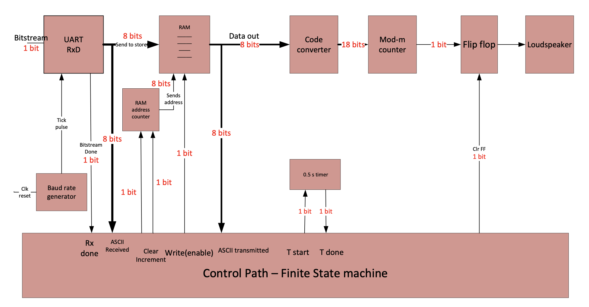
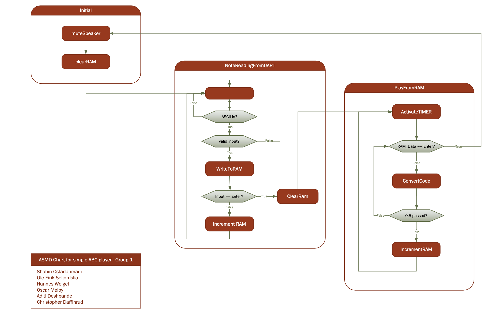
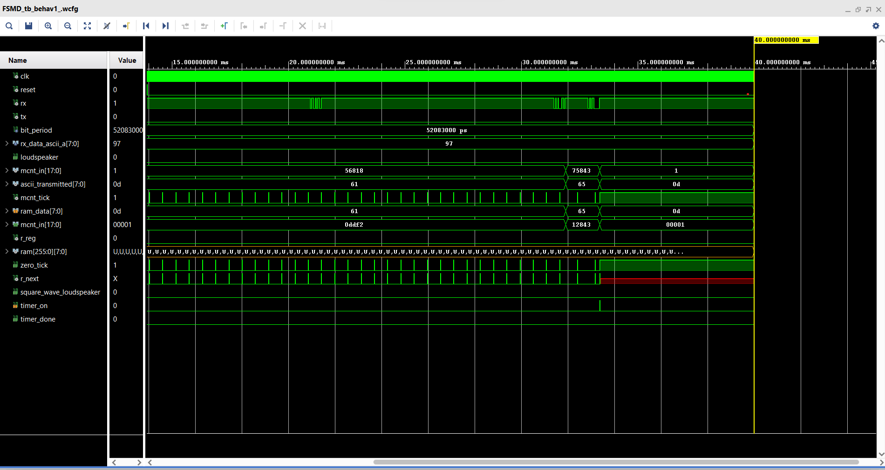

# ABC Player - Group 1

## Our Group:
- Christopher Daffinrud
- Ole Eirik Solberg Seljordslia
- Aditi Deshpande
- Hannes Weigel
- Oscar Melby
- Shahin Ostadahmadi

## Objective
We wanted to create an ABC-player where we could write in musical notations in the terminal.
The notes we wanted to play is as follows:
- Lower Octave: a, b, c, d, e, f, g, h
- Higher Octage: A, B, C, D, E, F, G, H

The Enter-key is to be used for as the trigger for playing the notes that has been entered up until the Enter-key is read from memory.

## Components and Division Of Labor
To create this functionality we figured we needed several components for our project that we divided between our group members:
- UART with Baud Rate Generator (Ole)
- RAM with an Adress Counter (Hannes)
- Code converter (Oscar)
- Mod-m counter (Aditi)
- Flip Flop (Aditi)
- Timer (Oscar)
- Control Path (Shahin and Christopher)
- Top module(Aditi)

## Diagrams

We created diagrams before we started to implement the components: 

1. FSMD Chart (Aditi)  

2. ASMD Chart (Shahin and Christopher)  

These were created and used as a blueprint for trying to make sure that we all were on the same logical track.

## Result

The result was not what we expected. If one observes the simulation file, we send asciii codes but they never become square wave outputs. This is most probably because the ram is not storing the data until enter is pressed, it is sending it forward to the code converter at once. If we had more time, we would look at why this problem happened and try to solve this. We have learnt a lot through this project, and taken with us rich knowledge.

